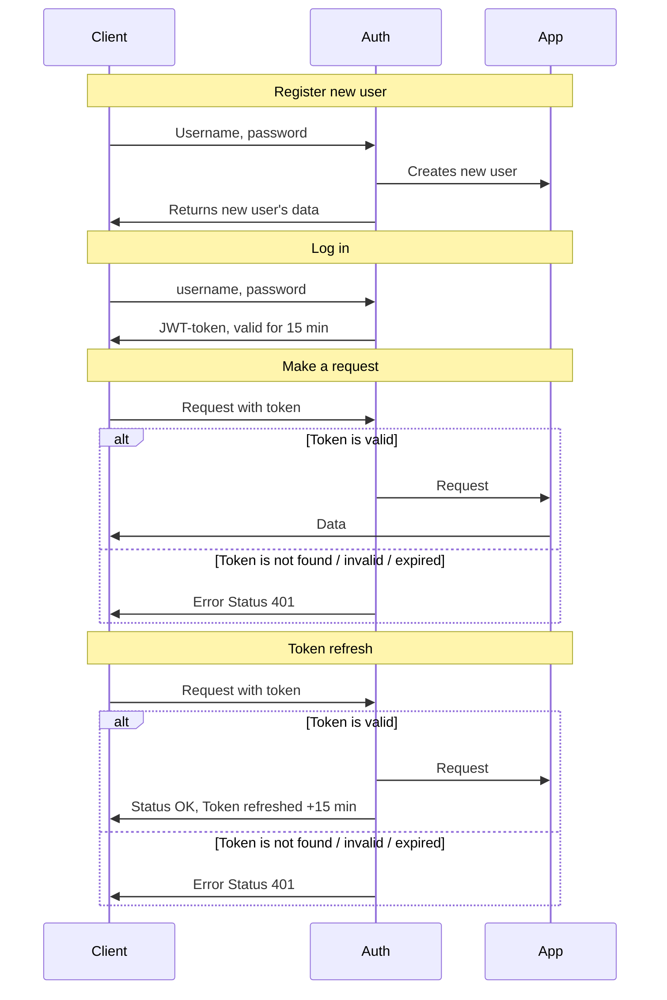

# Auth Service

[Go back](/README.md)

Auth Service provides a security layer for each of the request.

Now it supports only Login and Password flow; Google and Github flows are planned.

## Development

This service utilizes its own Postgres DB instance, and this DB should not be used by any other service. This service requires its own set of ENV vars to be set:

Env Var       | Explanation
--------------|------------
`DB_HOST`     | Auth Service's DB host. Not the same as the main App's DB
`DB_PORT`     | Auth Service's DB port. Must be different than the main App's DB port.
`DB_NAME`     | Auth Service's DB Name
`DB_USER`     | Auth Service's DB Username
`DB_PASSWORD` | Auth Service's DB Password
`JWT_SECRET`  | This is a "salt", which adds an additional security layer. Could be any string, the less "dictionary", the more secure.

## Simple Login flow

To make a request, place your JWT-token in `Authorization Bearer` header.

## DB Migration

DB Migration is done automatically, using ORM.
